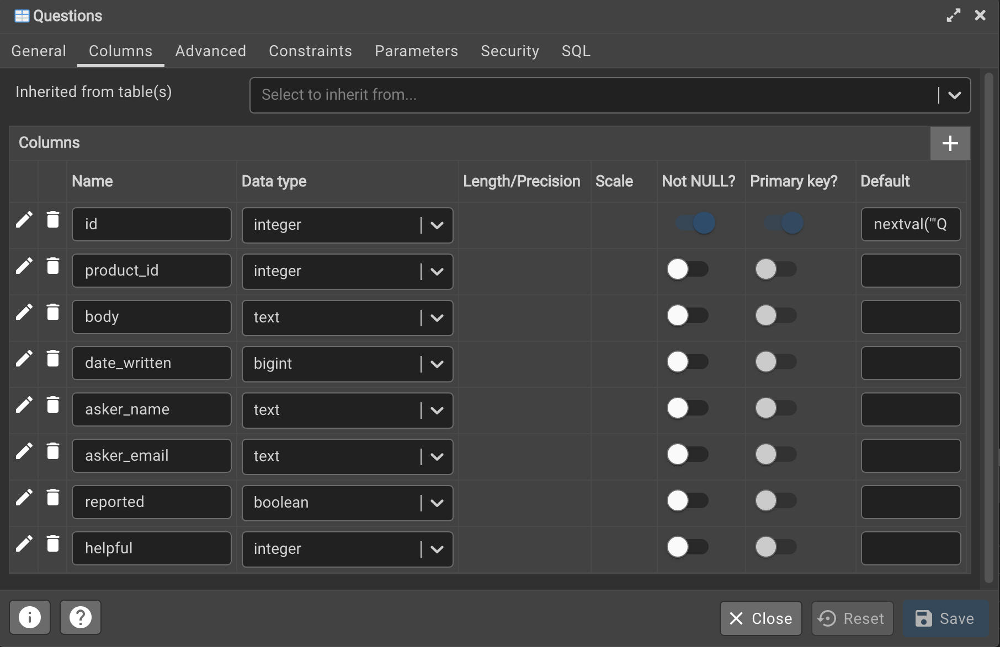
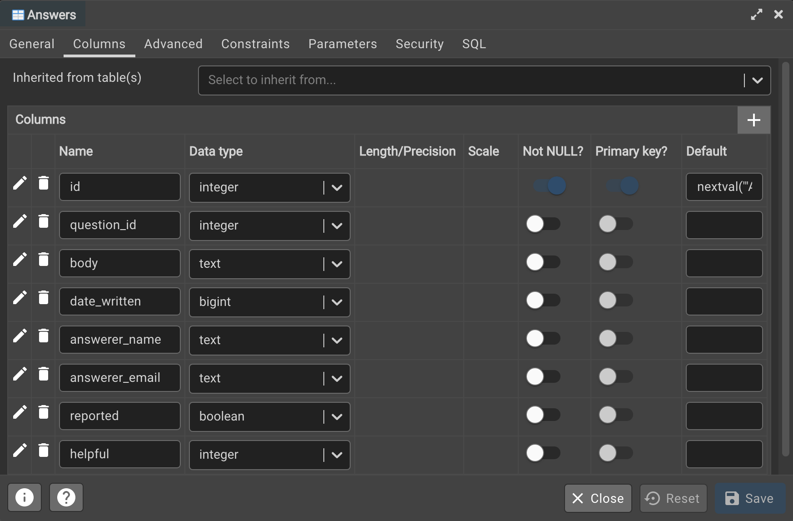
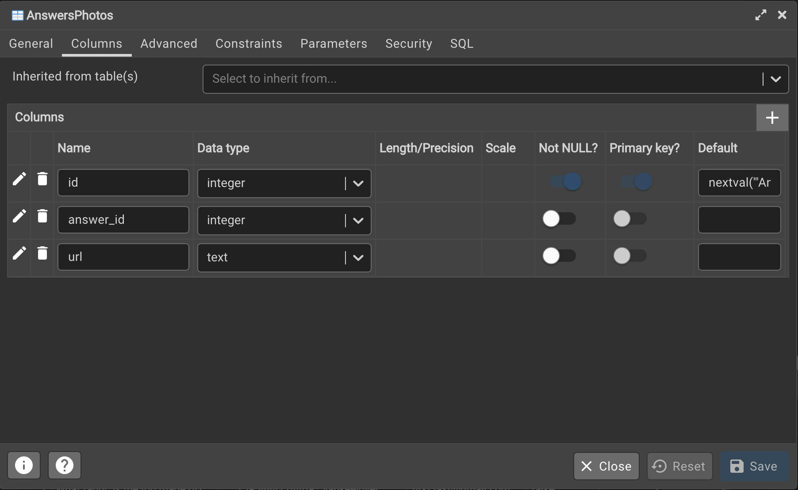

# Import the data using pgAdmin

Make your tables with columns in pgAdmin first. Be sure to follow the exact format of the data. Be sure you are using the public schema.

Right click on a table and select "Import/Export Data"

Make sure "Import" is selected, and select the CSV file to import. Make sure "Header" is selected because the CSV file should have headers in it.

