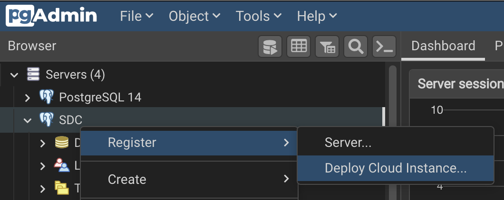
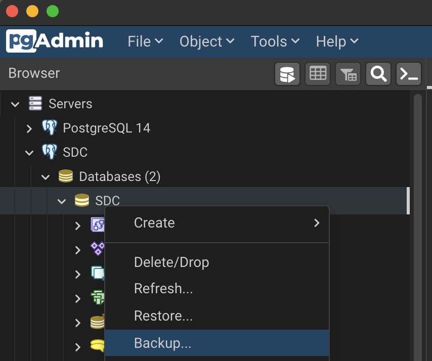

# Import the data using pgAdmin

Make your tables with columns in pgAdmin first. Be sure to follow the exact format of the data. Be sure you are using the public schema.


Right click on a table and select "Import/Export Data"


Make sure "Import" is selected, and select the CSV file to import. Make sure "Header" is selected because the CSV file should have headers in it.


# Deploy Cloud Instance

Use your favorite cloud service and create a PostgreSQL instance.

Or use pgAdmin to do it. (Only available option is an Amazon RDS at time of writing.)



# Export the data to the cloud

Use pgAdmin or CLI to make a dump of the database.



```
pg_dump SDC
```

Then restore that dump to your cloud-based database.
Easiest way is to use a URL. Replace the values in the following command appropriately.

```
pg_restore -d postgres://<USERNAME>:<PASSWORD>@<CLOUD_URL>:<PORT>/sdc SDC
```